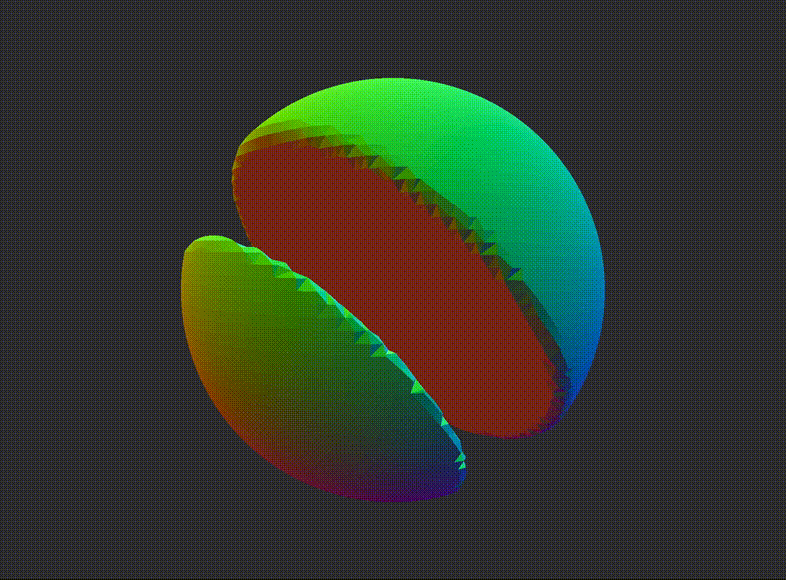

# MarchingCubes
Just a simple marching cubes experiment



## Linux

Marching Cubes depends on [libepoxy](https://github.com/anholt/libepoxy), [glfw3](https://www.glfw.org/) and [glm](https://glm.g-truc.net/)

```bash
#linux
sudo apt-get install libepoxy-dev libglfw3-dev libglm-dev

# macOS
brew install libepoxy glm glfw

```

The VSCode project depends on meson building into `build`
```bash
meson setup --layout flat build
```

Then you can open the project in VSCode
```build
code .
```

Note, since the VSCode build task depends on `build/compile_commands.json` it's recommended to run `meson setup build` once before opening the project in VSCode.

From here, the default build task is **ctrl-shift-b** and debugging via **F5** works as expected.

If using `gcc`, use `(gdb) Launch`, and if using `clang`, use `(CodeLLDB) Launch`. The latter requires the `CodeLLDB` extension to be installed.´