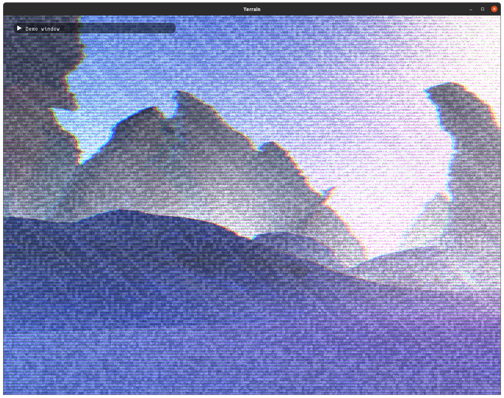

# MarchingCubes
Just a simple marching cubes experiment.

This started as an experiment in writing a multi-threaded marching cubes implementation, and spiralled slowly, inexoribly into an [LV-426](https://alienanthology.fandom.com/wiki/Acheron_(LV-426)) simulator, and *I couldn't be happier*.



## Building

Marching Cubes depends on [libepoxy](https://github.com/anholt/libepoxy), [glfw3](https://www.glfw.org/) and [glm](https://glm.g-truc.net/)

```bash
#linux (Debian/Ubuntu)
sudo apt-get install libepoxy-dev libglfw3-dev libglm-dev

```

The Zed project depends on meson building into `build`
```bash
# manually
CC=clang CXX=clang++ meson setup --buildtype debug build

# or alternately, using the justfile
just setup
```

Then you can open the project in Zed
```build
zed .
```

Note, since the Zed code completion and whatnot depends on `build/compile_commands.json` it's recommended to run `just setup` once before opening the project in Zed.

From here, launching and debugging via **F5** works as expected. Note: `CodeLLDB` is required.

## Running

The build specifies two targets, `hello_mc` which is a simple exploratory playground, and `terrain` which is an "infinite" procedural world.
